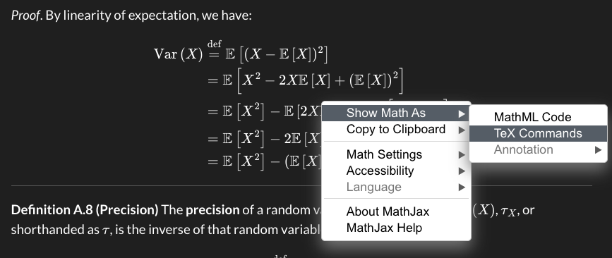
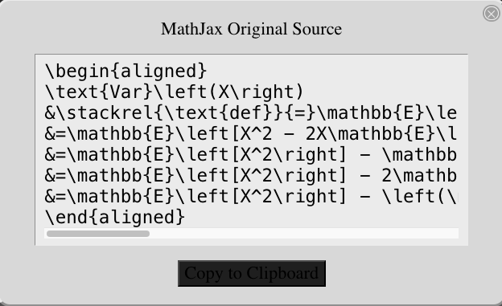

### Extracting LaTeX commands from the online version of the notes {.unnumbered}

If you want to extract the LaTeX commands for any math expressions in the online lecture notes, you should be able to right-click and get this pop-up menu:

{#fig-right-click-math}

If you select "TeX commands", you will get a window with LaTeX code.^[[MathJax](https://www.mathjax.org/) is more or less a dialect of LaTeX]

{#fig-LaTeX-source-code-popup}

You can also grab the TeX commands from the Quarto source files on GitHub,
but those files use custom macros
(maintained at <https://github.com/d-morrison/macros>),
so it's a little harder to reuse code from the source files.

---

### Using the LaTeX macros in your own project {.unnumbered}

The custom LaTeX macros used in these notes are maintained in a separate repository:
<https://github.com/d-morrison/macros>.
You can reuse them in your own Quarto project in two ways:

#### Option 1: Copy `macros.qmd` directly {.unnumbered}

Download or copy `macros.qmd` from
<https://github.com/d-morrison/macros/blob/main/macros.qmd>
into your project directory,
then include it immediately after the YAML front matter of each `.qmd` file that uses the macros:

``` markdown
{}
```

#### Option 2: Add as a git submodule {.unnumbered}

Add the macros repository as a [git submodule](https://git-scm.com/book/en/v2/Git-Tools-Submodules)
so that your project always tracks a specific version of the macros:

``` bash
git submodule add https://github.com/d-morrison/macros.git latex-macros
```

Then include the macros immediately after the YAML front matter of each `.qmd` file:

``` markdown
{}
```

When cloning a repository that uses this submodule, run:

``` bash
git clone --recurse-submodules <your-repo-url>
```

Or, if you have already cloned the repository without the submodule:

``` bash
git submodule update --init --recursive
```
