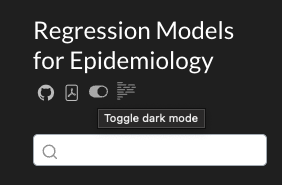

# Preface {.unnumbered}

This web-book is derived from my lecture slides for Epidemiology 204: "Quantitative Epidemiology III: Statistical Models", at UC Davis.

I have drawn these materials from many sources, including but not limited to:

- [David Rocke](https://dmrocke.ucdavis.edu/)'s materials from the [2021 edition of this course ](https://dmrocke.ucdavis.edu/Class/EPI204-Spring-2021/EPI204-Spring-2021.html)

- [Hua Zhou](https://hua-zhou.github.io/)'s materials from the [2020 edition of Biostat 200C at UCLA](https://ucla-biostat-200c-2020spring.github.io/schedule/schedule.html)

- @vittinghoff2e

- @dobson4e

- @rms2e

::: callout-important
I do not claim any of this content as my own original intellectual work.
I have attempted to provide more detailed disclaimers for specific sections 
that are heavily derivative of, or even copied directly from, external sources.

Please see also the list of contributors on GitHub: <https://github.com/d-morrison/rme/graphs/contributors>

:::

## Using these lecture notes {.unnumbered}

This website provides lecture notes for Epidemiology 204: Quantitative Epidemiology III (Statistical Models) at UC Davis.

The notes are available online at <https://d-morrison.github.io/rme/> and are searchable and continuously updated^[see the source file repository for recent changes: <https://github.com/d-morrison/rme>].

### Multiple Format Options {.unnumbered}

Each chapter is available in three formats:

1. **HTML (Website)**: Browse chapters online with navigation and search
2. **RevealJS Slides**: Presentation slides for teaching (e.g., `logistic-regression-slides.html`)
3. **PDF Handouts**: Printable documents for each chapter (e.g., `logistic-regression-handout.pdf`)

### Compiling chapters locally {.unnumbered}

To compile chapters from source:

1. [Install Quarto](https://quarto.org/docs/get-started/)

2. Clone the project repository from [GitHub](https://github.com/d-morrison/rme),
including the `latex-macros` [submodule](https://git-scm.com/book/en/v2/Git-Tools-Submodules):

``` bash
git clone --recurse-submodules https://github.com/d-morrison/rme.git
cd rme
```

If you have already cloned the repository without the submodule,
you can initialize it with:

``` bash
git submodule update --init --recursive
```

3. Install R package dependencies:

``` r 
library(devtools)
devtools::install_deps()
```

4. Render all output formats (HTML website, RevealJS slides, and PDF handouts):

``` bash
quarto render
```

---

### Extracting LaTeX commands from the online version of the notes {.unnumbered}

If you want to extract the LaTeX commands for any math expressions in the online lecture notes, you should be able to right-click and get this pop-up menu:

{#fig-right-click-math}

If you select "TeX commands", you will get a window with LaTeX code.^[[MathJax](https://www.mathjax.org/) is more or less a dialect of LaTeX]

{#fig-LaTeX-source-code-popup}

You can also grab the TeX commands from the quarto source files on github,
but those files use custom macros
(defined in <https://github.com/d-morrison/macros>),
so it's a little harder to reuse code from the source files.

---

### Using the LaTeX macros in your own project {.unnumbered}

The custom LaTeX macros used in these notes are maintained in a separate repository:
<https://github.com/d-morrison/macros>.
You can reuse them in your own Quarto project in two ways:

#### Option 1: Copy `macros.qmd` directly {.unnumbered}

Download or copy `macros.qmd` from
<https://github.com/d-morrison/macros/blob/main/macros.qmd>
into your project directory,
then include it at the top of each `.qmd` file that uses the macros:

``` markdown

```

#### Option 2: Add as a git submodule {.unnumbered}

Add the macros repository as a [git submodule](https://git-scm.com/book/en/v2/Git-Tools-Submodules)
so that your project always tracks a specific version of the macros:

``` bash
git submodule add https://github.com/d-morrison/macros.git latex-macros
```

Then include the macros at the top of each `.qmd` file:

``` markdown

```

When cloning a repository that uses this submodule, run:

``` bash
git clone --recurse-submodules <your-repo-url>
```

Or, if you have already cloned the repository without the submodule:

``` bash
git submodule update --init --recursive
```

---

### Dark Mode {.unnumbered}

The online notes have two color palette themes: light and dark.
You can toggle between them using the oval button near the top-left corner:

{#fig-palette-toggle}

## Other resources {.unnumbered}

These notes represent my still-developing perspective on regression models in epidemiology. 
Many other statisticians and epidemiologists have published their own perspectives, 
and I encourage you to explore your many options and find ones that resonate with you. 
I have attempted to cite my sources throughout these notes. 

Here are some additional resources that I've come across; 
I haven't had time to read some of them
thoroughly yet, but they're all on my to-do list. 
I'll add my thoughts on them over time.




## License {.unnumbered}

This book is licensed to you under [Creative Commons Attribution-NonCommercial-NoDerivatives 4.0 International License](http://creativecommons.org/licenses/by-nc-nd/4.0/).

The code samples in this book are licensed under [Creative Commons CC0 1.0 Universal (CC0 1.0)](https://creativecommons.org/publicdomain/zero/1.0/), i.e. public domain.

